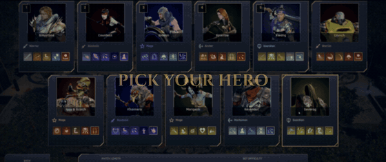
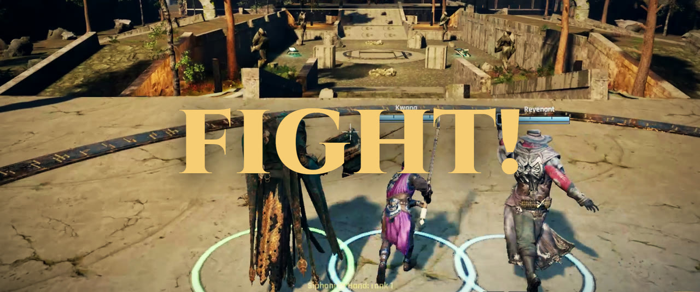
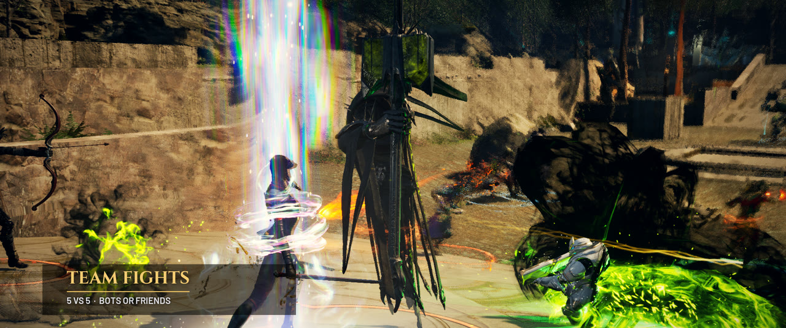
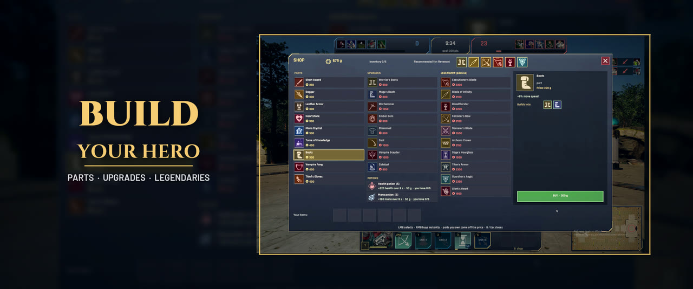
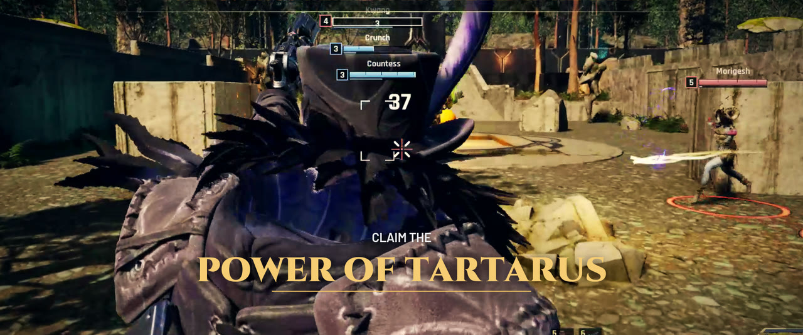
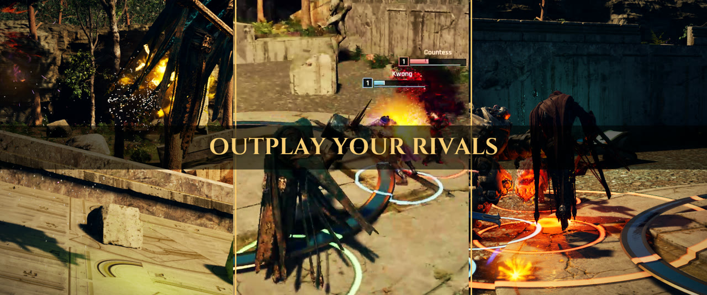
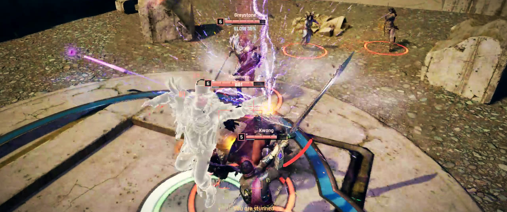

# Tartarus Arena

  

  <b>A 5v5 MOBA in Unreal Engine 5.8, built end to end by Claude with the Dark Factory Patterns.</b> 
  <a href="media/TartarusArena_Teaser.mp4">▶ Watch the teaser (59 s)</a> ·
  <a href="docs/BUILT-WITH-CLAUDE.md">How it was built</a> ·
  <a href="docs/DARK-FACTORY-FIELD-REPORT.md">DF field report</a> ·
  <a href="docs/TESTING.md">The evidence</a> ·
  <a href="docs/USING-PARAGON-ASSETS.md">Epic's Paragon assets</a>

  
  
  
  
  

**Seven days, one human, one AI agent.** Eleven heroes, two game modes on two maps, bots that read the game, a
training center, LAN play, two prototypes of a new game, a full verification harness and the teaser above. Every
line of C++, the Python tools that build the maps, the data, the tests, the in-game labs, these docs and the teaser
were written by **Claude** (Anthropic's Claude Code) working as a **Dark Factory** agent, between 2026-09-26 and
2026-10-02, in 22 versions. Each version shipped with evidence. The human operator set the goals, played the builds,
gave feedback in plain language and made the decisions only a human should make.

> **Not affiliated with Epic Games.** The characters, environments, animations and voices are Epic Games' free
> Paragon assets, used under Epic's license for Unreal Engine projects and not redistributed here. *Paragon* is a
> trademark of Epic Games, Inc. The game's working title was "Paragon Arena"; it was renamed because Epic's listings
> say "You may not use the trademark PARAGON to advertise or name your game". The Unreal project and its C++ module
> keep the internal identifier `ParagonArena`. Details: [docs/USING-PARAGON-ASSETS.md](docs/USING-PARAGON-ASSETS.md).

## Built with Claude and the Dark Factory Patterns

[The Dark Factory](https://github.com/OneDro1d/dark-factory) is a method for *autonomous, governed, evidence-gated
delivery*: an agent works without a human in the inner loop and stays trustworthy, because its summaries are never
accepted on their own. Only raw evidence counts: test results, lab output, measurements, screenshots that anyone
can re-run or re-check. A build moves through gated stages, and the agent comes back to the human only when the goal
is met or a decision is the human's. This is how the stages show up in this repository:

| Dark Factory stage | In this repository |
|---|---|
| **Product owner** — vision, requirements as rules, test scenarios | [`01-game-design.md`](docs/dark-factory/01-game-design.md): pillars with numeric targets, 30 validation rules, 14 scenarios; every fact tagged *confirmed by the operator*, *agent's assumption* or *open* |
| **Solution architect** — data, flows, decisions | [`02-technical-design.md`](docs/dark-factory/02-technical-design.md): the core rules mapped to where and how they are enforced; 14 dated ADRs |
| **TDD** — the test list *is* the rules | pure rule functions (damage, gold, shop, ranks, the bot brain, Conquest) under 6 automation specs, 17 tests in v1, 50 today |
| **QA with evidence** | ~15 in-game *labs* that drive the real game and print `LAB PASS/FAIL`, seeded headless bot matches, the packaged exe re-checked in nearly every release: [`TESTING.md`](docs/TESTING.md) and a QA report per version or pair of versions |
| **Adversary gate** | a blind, read-only reviewer agent found 13 real defects in the network code; decoy checks prove each gate can fail |
| **The autonomous loop** | hard stops (publishing, spending, downloads, deleting the owner's data, windows on the owner's desktop) wait for the human; everything else the agent decides and proves |

The full story, with the timeline of all 22 versions, the numbers, the engineering lessons and an honest list of
what is and is not proven: **[docs/BUILT-WITH-CLAUDE.md](docs/BUILT-WITH-CLAUDE.md)**.

**A field test of the method.** What a game adds to DF, which gate caught which defect, where the run deviated from
the method, eleven conclusions and the options they open: **[docs/DARK-FACTORY-FIELD-REPORT.md](docs/DARK-FACTORY-FIELD-REPORT.md)**.

**Next: an independent holdout test with Argus.** The game is prepared as a system under test for OneDroid's
[Argus](https://docs.onedroid.ai/argus): the packaged game journals its own evidence as JSON, and a small HTTP harness
starts its headless checks on request. Ready, not yet tested by Argus: **[docs/ARGUS.md](docs/ARGUS.md)**.

## Screenshots

| | |
|---|---|
|  |  |
|  |  |
|  |  |

### The teaser was made by the agent too

The game films itself: `-ArenaTeaser=<scene>` starts an in-engine director that finds the hottest fight, frames it
and records it frame by frame. The music is synthesised from scratch in Python (no samples). The 3D title cards are
rendered in Blender, and the motion-design edit (kinetic type, the shop panel, the split screen) is built by a
script in Blender's sequencer. The cut mixes the director's takes with the operator's own play. Pipeline:
[Tools/Teaser/](Tools/Teaser/); the media and how to credit them: [media/](media/).

## At a glance

| | |
|---|---|
| Engine | Unreal Engine 5.8, C++, Gameplay Ability System, Enhanced Input, Chaos |
| Code | ~22,000 lines of C++ in 80 files and ~5,500 lines of Python tooling, all written by Claude |
| Heroes | 11 Paragon heroes (Greystone, Countess, Gideon, Sparrow, Kwang, Crunch, Iggy & Scorch, Khaimera, Morigesh, Revenant, Sevarog), 5 abilities each, 38 skins |
| Modes | **Arena** (5v5, 3v3 Skirmish, 1v1 Duel on the Arena map) and **Conquest** (5v5 on its own map: three lanes, towers, inhibitors, cores, jungle camps, a boss) |
| Maps | 4, all built by Python scripts: Arena, Conquest, Training, Proto |
| Players | single player with bots (three difficulties), LAN multiplayer (listen server, join by IP, bots fill the rest) |
| Prototypes | a new game in a grey-box town: third-person action combat, and the same game with Hades-style controls |
| Verification | 50 automation tests in 6 specs, ~15 self-checking in-game labs, seeded headless bot matches, a packaged-exe check in nearly every release |

## What you can play

- **Arena** — a Smite-style 5v5 over-the-shoulder MOBA: team points from kills and minions, a Power of Tartarus orb
  to fight over, levels 1–20 with ability ranks, a 27-item shop with recipes and legendary passives, recall, fountain,
  potions, revive for gold, bounties, a death recap.
- **Conquest** — LoL-style lanes on a big jungle map: towers and inhibitors protecting each core, heavy minions, neutral
  camps with buffs and the Prime Helix boss; the match ends when a core falls.
- **Training center** — a grey room with dummies, a moving target, a ramp, no-cooldown and level-20 switches and a DPS meter.
- **Hero browser** — every hero on a live 3D preview; clicking an ability plays it with its effects.
- **Bots** that read the game: they kite, dodge, jump, focus weak targets, respect towers, back off when outnumbered,
  manage mana, siege when they have the numbers, and play a lane in Conquest.
- **New game · prototype** and **New game 2 · Hades controls** — the same town, characters and combat (combos,
  heavy attacks, perfect dodges, juggles, mantling, wall jumps) with two control schemes, each with its own bot.

Settings: quality presets up to *Epic · Lumen* (Lumen GI and reflections on DirectX 12 SM6), window mode,
resolution, render scale, frame limit, V-sync, volume, mouse, three ability-casting modes (quick / instant / with
confirmation), aim assist, camera shake, damage numbers, field of view, UI scale, a colour-blind mode, key rebinding
and gamepad support.

## Controls (Arena and Conquest)

| | |
|---|---|
| Move · aim · jump | WASD · mouse · Space |
| Basic attack | left mouse button (hold to keep attacking) |
| Abilities | 1–4 (4 is the ultimate); **Ctrl + 1–4** ranks an ability up; right mouse button cancels; **Alt** shows the full tooltip |
| Shop · recall | **B** in base opens the shop, outside it recalls (6 s); **P** opens the shop anywhere (buying works in base or while dead) |
| Potions · revive | **5** health, **6** mana · **F** revives for gold after death |
| Team | **G** pings · **Tab** scoreboard · **Esc** pause menu |
| Gamepad | A jump, RT attack, RB / LB / X / Y abilities, LT + ability ranks up, B shop / recall, Start pause |

The prototypes show their own controls card when a match starts.

## Getting started

### Requirements

- **Unreal Engine 5.8** (Epic Games Launcher) and **Visual Studio 2026** with *Game development with C++*.
- About 60 GB of free disk space for the packs, the derived data and a cook.
- From your Fab library, **added to this project** (launcher → Library → Fab Library → *Add to project* → ParagonArena):
  the Paragon heroes **Greystone, Countess, Gideon, Sparrow, Kwang, Crunch, Iggy & Scorch, Khaimera, Morigesh,
  Revenant, Sevarog**, **Paragon: Minions**, **Paragon: Agora and Monolith** (the environment props) and the
  **Open World Demo Collection** (`KiteDemo`, the nature).
- Optionally the engine's template content (mannequins and prototyping blocks used by the prototypes):
  `powershell -File Tools/setup_placeholders.ps1`

### Build and generate the content

1. Build the editor:
   `"<UE_5.8>\Engine\Build\BatchFiles\Build.bat" ParagonArenaEditor Win64 Development -Project="<repo>\ParagonArena.uproject" -WaitMutex -NoHotReloadFromIDE`
2. Run the content scripts, each with
   `UnrealEditor-Cmd.exe <uproject> -run=pythonscript -script="<repo>\Tools\<script>.py" -unattended -nullrhi -culture=en`
   (the editor's language must be English for the material scripts), in this order:
   `make_materials.py` → `make_fade_materials.py` → `import_env_meshes.py` → `resave_pack_meshes.py` →
   `build_arena.py` → `build_conquest.py` → `build_training.py` → `build_proto.py` → `make_hitreacts.py` →
   `build_manifest.py` → `cap_textures.py`.
   - `make_hitreacts.py` turns the packs' additive hit reactions into regular animations and `make_fade_materials.py`
     makes copies of the character materials that can dither out after death. Both write to `Content/Arena/Generated/`,
     which is derived Epic content and therefore not in the repo.
   - `import_env_meshes.py` imports the project's own rock skirts from `Tools/Blender/out/*.fbx`, generated by
     `Tools/Blender/rock_skirts.py` in Blender 5.2 (`blender -b --factory-startup --python-exit-code 1 -P Tools/Blender/rock_skirts.py -- Tools/Blender/out`).
   - The icons in `Content/Arena/Icons` are already imported (`Tools/import_icons.py` re-imports `Tools/Icons/*.png`).
3. Open `ParagonArena.uproject`, or run the game from the editor build:
   `UnrealEditor.exe <uproject> -game` (Arena), or with `/Game/Maps/Conquest`, `/Game/Maps/Proto` before `-game`.

### Package a Windows build

`"<UE_5.8>\Engine\Build\BatchFiles\RunUAT.bat" BuildCookRun -project="<uproject>" -noP4 -platform=Win64 -clientconfig=Shipping -build -cook -stage -pak -iostore -compressed -archive -archivedirectory="<repo>\Build" -IgnoreCookErrors -nocompileeditor`
→ `Build/Windows/ParagonArena.exe`

- `-IgnoreCookErrors`: the packs' sample `*PlayerCharacter` blueprints do not compile in UE 5.8. The game does not use
  them, so they are left out of the build.
- Assets the code reaches only through a path in `heroes.json` must be listed under `DirectoriesToAlwaysCook` in
  `Config/DefaultGame.ini`.
- The Zen store is off (`bUseZenStore=False`): it rewrote a ~15 GB oplog on the system drive and silently dropped
  packages when that drive filled up. A full cook takes about 1 h 40 min and ~27 GB of free space.
- A Shipping build ignores a map given on its command line: use `-ArenaStartMap=Conquest` (or `Proto`, `Training`).
  It also writes no log; its labs and measurements write `.txt` files to `%LOCALAPPDATA%\ParagonArena\Saved`.

## Verification

Every feature lands with evidence. The full catalogue is in [docs/TESTING.md](docs/TESTING.md).

- **Automation tests:** `UnrealEditor-Cmd.exe <uproject> -ExecCmds="Automation RunTests Arena;Quit" -unattended -nullrhi`
  (rules, data, bot brain, Conquest, balance).
- **In-game labs** (`-ArenaAnimLab`, `-ArenaMechLab`, `-ArenaAimLab`, `-ArenaSkillLab`, `-ArenaFxLab`, `-ArenaBaseLab`,
  `-ArenaConquestLab`, `-ProtoLab`, …): each runs a scripted scenario inside the real game, prints `LAB PASS/FAIL` per
  check and `LAB_SUMMARY fails=N`, and takes screenshots.
- **Seeded bot matches:** `/Game/Maps/Arena -game -nullrhi -ArenaBotMatch -Seed=1 -Minutes=3 -benchmark -fps=60`
  plays ten bots and prints `ARENA_SUMMARY` (stuck bots, casts, turn snaps, jumps, deaths by cause) and validation-rule
  lines such as `PASS VR-09`.
- **As a system under test:** `node Tools/ArgusSUT/server.mjs` serves the packaged game's headless checks over HTTP,
  with `-EvidenceJournal=<id>` journaling every log line as JSON, ready for an Argus tester ([docs/ARGUS.md](docs/ARGUS.md)).

## Repository layout

| Path | What is there |
|---|---|
| `Source/ParagonArena/Core` | pure rules: damage, shields, team points, gold, shop and recipes, ranks and XP, respawn, Conquest rules (unit-tested, no UObjects) |
| `Source/ParagonArena/Data` | the data contract of heroes, abilities, items, structures and camps; loads and validates `Content/Data/heroes.json` |
| `Source/ParagonArena/GAS`, `Abilities` | attributes, and one data-driven GAS ability (melee, projectile, area, dash, buff) with its projectile and area actors |
| `Source/ParagonArena/Heroes` | the character (heroes, minions, structures, monsters): camera, status effects, hit-stop, reactions and deaths from the packs' animations, the melee trait |
| `Source/ParagonArena/AI` | the bot brain (a pure decision function, unit-tested) and the bot controller |
| `Source/ParagonArena/Game` | game mode and state (phases, waves, Conquest, LAN), the player controller, the labs, the teaser director, the evidence journal |
| `Source/ParagonArena/UI` | the Canvas HUD and menus, settings, the icon studio (portraits and icons shot from the models in game) |
| `Source/ParagonArena/Arena` | ability indicators, jump pads, the orb, foliage scatter, effects and explosion physics |
| `Source/ParagonArena/Proto` | the new-game prototypes (character, bot, two player controllers, HUD, game mode) |
| `Source/ParagonArena/Tests` | the automation specs |
| `Content/Data/heroes.json` | every hero, ability, item, structure, camp and rule as data |
| `Content/Maps`, `Content/Arena` | the four maps, the project's materials and icons |
| `Tools/` | the map builders and content scripts (Python for the UE editor), Blender scripts, the icon sources, the teaser pipeline, the Argus SUT harness (`Tools/ArgusSUT`) |
| `docs/` | how it was built, the DF field report, the DF documents, the testing guide, the Epic-assets terms |
| `media/` | the teaser, its preview, the poster and screenshots ([media/README.md](media/README.md)) |

## Credits and legal

- **Epic Games:** the Paragon packs (heroes, minions, environment props, animations, effects, voice lines), the Open
  World Demo Collection and the engine's templates. They are Epic content, free for Unreal Engine developers on Fab
  and used under Epic's license. They are not in this repository; each user adds them from their own Fab library.
  *Paragon* is a trademark of Epic Games, Inc.; this project is not affiliated with or endorsed by Epic Games.
- **Icons:** game-icons.net, CC BY 3.0 (authors listed in [CREDITS.md](CREDITS.md)).
- **Fonts:** Barlow, Barlow Condensed, Rajdhani and Cinzel, SIL Open Font License 1.1 (license texts in `Content/Data/Fonts`).
- **Sound and music:** the hit sounds are synthesised in code (`Arena/ArenaHitSound.h`); the teasers' music is
  synthesised from scratch by `Tools/Teaser/music*.py`, with no samples.
- **Code, tools and docs:** written by Claude for the project owner, released under the [MIT License](LICENSE) (scope: [NOTICE.md](NOTICE.md)).
  The license covers only the project's own work. It does not cover Epic Games' content, which stays under Epic's terms
  ([docs/USING-PARAGON-ASSETS.md](docs/USING-PARAGON-ASSETS.md)), or the fonts (OFL) and icons (CC BY 3.0), which keep
  their own licenses ([CREDITS.md](CREDITS.md)).
